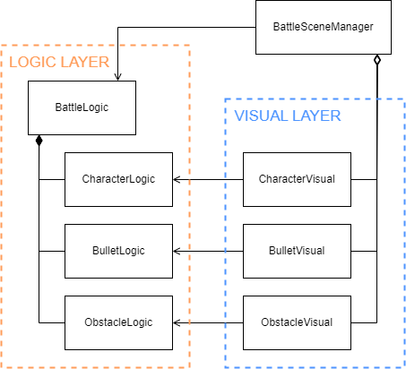
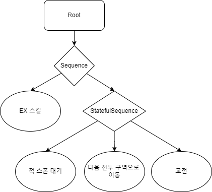
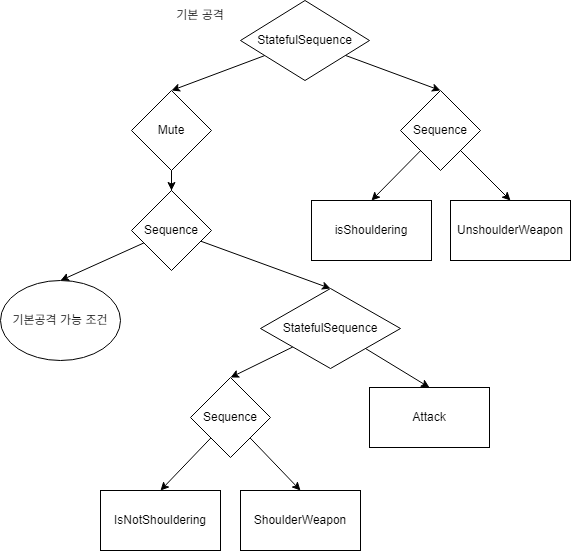
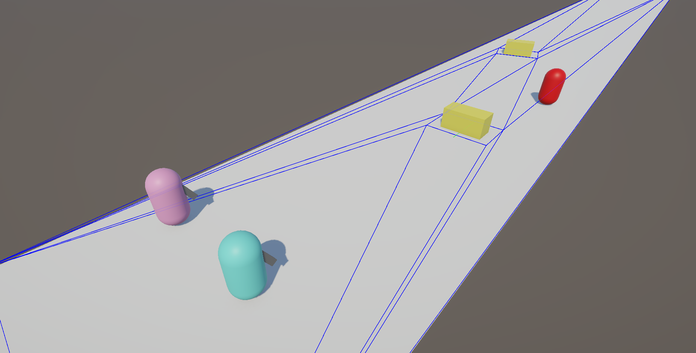

# 블루아카이브 전투 모작
시연 영상(Youtube 링크) :

# 핵심 포인트

* [초고속 시뮬레이션을 위한 Logic과 Visual 레이어 구분](#구조-설명)
* [실제 게임과 유사한 Behaviour Tree 구현](#Behavior-Tree)
* [자체적인 Navigation system 구현](#Navigation-System)

## 구조 설명

블루아카이브에는 비동기식 PVP 컨텐츠 '전술대항전'이 존재하며, 해당 전투는 스킵이 가능합니다. 따라서, 실제 전투 로직을 매우 빠르게 시뮬레이션할 필요가 있습니다.

이를 위해 Logic과 Visual 레이어를 구분, Logic 부분은 Unity에 의존하지 않도록 작성하여 빠르게 시뮬레이션하기 매우 용이하게 구성하였습니다.

`BattleLogic.Tick()`은 Logic 레이어의 모든 객체를 업데이트합니다.

Visual 레이어의 각 객체는 대응하는 Logic 레이어의 객체를 참조하며, 필드 참조나 이벤트 구독 등으로 정보를 받아와서 화면에 표시합니다.

## Behavior Tree

직접 구현한 Behavior Tree 시스템을 사용하여 캐릭터의 AI를 구현하였습니다.

BT의 구성에는 [NDC 2009 발표](https://www.slideshare.net/slideshow/2009-ndc/43767857)를 참고하였습니다.

`StatefulSequence`는 마지막으로 수행한 자식의 인덱스를 기억하고 있는 특수한 Sequence 노드로, 한 번 선택된 행동이 성공 또는 실패로 끝날 때까지 계속해서 수행될 수 있게 해줍니다.

기본 공격을 구현하는 BT입니다. 기본공격 사용 전에는 견착을 수행하며, 재장전이나 위치 이동 등 기본공격이 종료될 때에는 견착을 해제하도록 되어있습니다.

## Navigation System

고속 시뮬레이션을 위해 Unity의 Navigation 시스템을 사용하지 않고 대신 POCO(Plain old C# object)만으로 구현된 길찾기 시스템을 구현하였습니다.

[Triangle.Net](https://github.com/wo80/Triangle.NET/tree/master)을 사용하여 삼각분할을 수행, 분할된 삼각형을 Convex를 유지하도록 병합하여 NavMesh를 계산하였고, A* 알고리즘과 stupid funnel 알고리즘을 사용하여 최단경로를 탐색하였습니다.

추가로, NavLink도 구현하여 캐릭터가 엄폐물을 뛰어넘을 수 있도록 하였습니다. 

